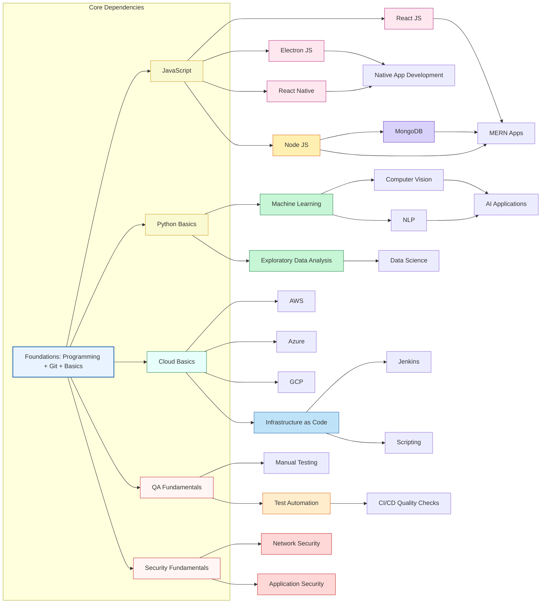

# Learning Diagrams

This file contains visual learning maps for the repository using Mermaid syntax.

## Learning Path Flowchart

```mermaid
flowchart TD
    A[Start: Beginner Learner] --> B[Core Foundations]
    B --> C[AI]
    B --> D[DevOps]
    B --> E[Data Science]
    B --> F[Cybersecurity]
    B --> G[MERN]
    B --> H[Native App]
    B --> I[QA]

    C --> C1[Machine Learning]
    C --> C2[Computer Vision]
    C --> C3[NLP]

    D --> D1[AWS]
    D --> D2[Azure]
    D --> D3[GCP]
    D --> D4[Jenkins]
    D --> D5[Scripting]

    E --> E1[Exploratory Data Analysis]

    F --> F1[Network Security]
    F --> F2[Application Security]

    G --> G1[JavaScript]
    G --> G2[React JS]
    G --> G3[Node JS]
    G --> G4[MongoDB]
    G --> G5[MERN Project]

    H --> H1[Electron JS]
    H --> H2[React Native]

    I --> I1[Manual Testing]
    I --> I2[Test Automation]

    C1 --> C_Deploy[AI Deployment Basics]
    D4 --> D_CI[CI/CD Pipelines]
    G2 --> G_Frontend[Front-End App Development]
    G3 --> G_Backend[Backend API Development]
    G4 --> G_Data[Database Integration]
    G5 --> G_Launch[MERN Project Launch]
    H2 --> H_Mobile[Mobile App Deployment]
    I2 --> I_CI[QA in CI/CD]

    style A fill:#f9f,stroke:#333,stroke-width:2px
    style B fill:#cff,stroke:#333,stroke-width:2px
    style C fill:#cfc,stroke:#333,stroke-width:1px
    style D fill:#ccf,stroke:#333,stroke-width:1px
    style E fill:#ffc,stroke:#333,stroke-width:1px
    style F fill:#fcc,stroke:#333,stroke-width:1px
    style G fill:#fcf,stroke:#333,stroke-width:1px
    style H fill:#cff,stroke:#333,stroke-width:1px
    style I fill:#ccc,stroke:#333,stroke-width:1px
```

## Topic Dependency Diagram

## Notes
- The first diagram shows a guided learning path from the root learning foundation to each major category and its subtopics.
- The second diagram shows how core knowledge areas depend on one another and which topics are natural prerequisites for the related learning paths.
- Use a Mermaid-compatible renderer to view these diagrams directly in markdown preview.
